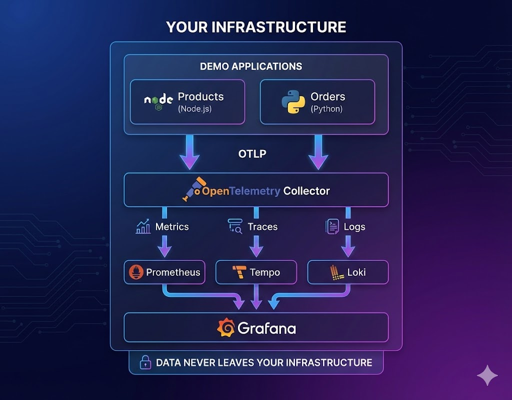

# On-Premise Observability Stack

Complete observability with Grafana, Prometheus, Loki, and Tempo. Open source. No per-host licensing. Your data stays in your infrastructure.

## Why This Exists

Datadog and NewRelic solve observability well. They also cost $15,000-50,000/year for 50 hosts, send all your telemetry to their cloud, and lock you into their ecosystem.

If any of these apply to you, keep reading:

- **Cost**: You're spending too much on observability SaaS
- **Data sovereignty**: Telemetry data cannot leave your network
- **Compliance**: GDPR, HIPAA, or SOC2 requirements restrict third-party data access
- **Retention**: You need more than 8-15 days of data without paying extra
- **Vendor lock-in**: You want to own your observability stack

## What You Get

| Capability | This Stack | Datadog | NewRelic |
|------------|------------|---------|----------|
| Infrastructure metrics | Prometheus | $15-23/host/mo | $0.25/GB |
| Log aggregation | Loki | $0.10/GB + indexing | $0.30/GB |
| Distributed tracing | Tempo | $31/host/mo | Included (limits apply) |
| Dashboards | Grafana | Included | Included |
| Data retention | Unlimited | 15 days default | 8 days default |
| Data location | Your infrastructure | Datadog cloud | NewRelic cloud |
| Licensing cost | $0 | $$$ | $$$ |

## Quick Start

```bash
git clone https://github.com/jsalvarredy/grafana-otel-demo
cd grafana-otel-demo
./setup.sh
```

Add to `/etc/hosts`:
```
127.0.0.1 grafana-otel-demo.localhost otel-example.localhost python-otel-example.localhost
```

Access Grafana: http://grafana-otel-demo.localhost
- User: `admin`
- Password: `Mikroways123`

The demo includes two instrumented microservices (Node.js and Python) that generate realistic e-commerce telemetry.

## Cost Comparison

### Annual Cost for 50 Hosts + 100GB Logs/Month

| Vendor | Infrastructure | Logs | APM | Total |
|--------|---------------|------|-----|-------|
| Datadog Enterprise | $13,800 | $3,240 | $18,600 | ~$35,640/yr |
| NewRelic Pro | $6,000 | $360 | Included | ~$20,000/yr |
| This Stack | $0 licensing | $0 licensing | $0 licensing | Infrastructure only |

Self-hosted infrastructure cost (AWS example): ~$350/month for a production setup supporting 50 hosts.

**3-year savings: $50,000-150,000** depending on your current vendor.

See [docs/COST_ANALYSIS.md](docs/COST_ANALYSIS.md) for detailed breakdown.

## Architecture



## This is a Demo

This repository is designed for **evaluation**, not production deployment.

| Aspect | Demo | Production Required |
|--------|------|---------------------|
| Kubernetes | Kind (local) | Managed K8s or self-managed cluster |
| Storage | Ephemeral | Persistent volumes with backups |
| High availability | Single replicas | Multi-replica across zones |
| TLS | None | TLS everywhere |
| Authentication | Basic auth | SSO/OIDC integration |

For production deployment guidance, see [docs/PRODUCTION.md](docs/PRODUCTION.md).

## What's Included

### Observability Stack
- **Grafana** - Dashboards and visualization
- **Prometheus** - Metrics collection and alerting
- **Loki** - Log aggregation
- **Tempo** - Distributed tracing
- **OpenTelemetry Collector** - Telemetry pipeline

### Demo Applications
- **Products Service** (Node.js) - Catalog, search, inventory
- **Orders Service** (Python) - Order processing, user sessions

### Pre-built Dashboards
- Service Overview (RED metrics)
- Distributed Tracing
- Log Analysis
- Executive Summary

### Traffic Generator
```bash
./traffic.sh                     # Run 50 iterations
./traffic.sh --iterations 100    # Run 100 iterations
./traffic.sh --continuous        # Run until Ctrl+C
./traffic.sh --continuous --fast # Fast continuous traffic
```

## Documentation

| Document | Description |
|----------|-------------|
| [docs/API.md](docs/API.md) | REST API reference |
| [docs/TROUBLESHOOTING.md](docs/TROUBLESHOOTING.md) | Common issues and solutions |
| [docs/PRODUCTION.md](docs/PRODUCTION.md) | Production deployment guide |
| [docs/COST_ANALYSIS.md](docs/COST_ANALYSIS.md) | Detailed cost comparison |

## Requirements

- Docker (>=20.10)
- Kind (>=0.20)
- Kubectl (>=1.28)
- Helm (>=3.12)
- Helmfile (>=0.150)

## Cleanup

```bash
kind delete cluster --name grafana-otel-demo
```

## License

MIT - see [LICENSE](LICENSE)
