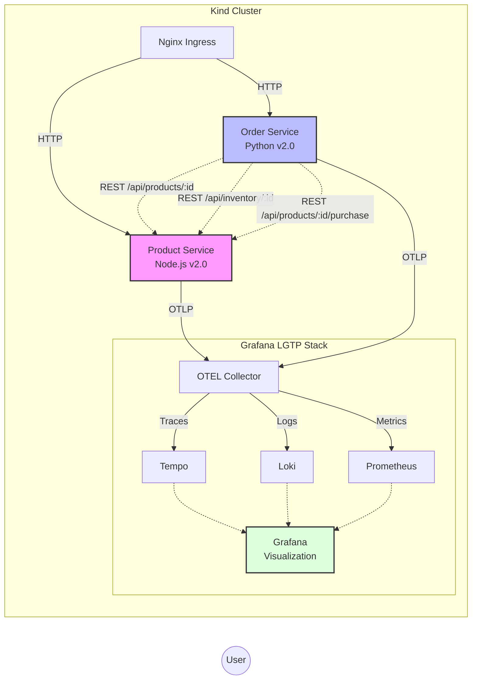

# Grafana LGTP + OpenTelemetry Demo

An observability demo using OpenTelemetry and the Grafana stack (Loki, Grafana, Tempo, Prometheus). Runs locally on a Kind cluster with a single command.

[](https://opentelemetry.io/)
[](https://grafana.com/)
[](https://kind.sigs.k8s.io/)
[](LICENSE)

## What's included

Two microservices simulating an e-commerce app (Products in Node.js, Orders in Python):

- 12 products with descriptions, ratings, and reviews
- Distributed traces across services with span events
- Automatic correlation between logs, traces, and metrics
- Pre-built dashboards
- Resilience patterns: circuit breakers, rate limiting, caching, retries
- Traffic generator with user sessions and load patterns

---

## v2.0 changes

### Products service
- Full-text search across names, descriptions, and tags
- Product recommendations by category
- Filtering by category, price range, rating, with sorting
- Cache simulation with hit/miss metrics
- Rate limiting with metrics
- Circuit breaker for database calls
- Variable latency based on load

### Orders service
- Order tracking with status history
- User session tracking
- Returning vs new customer detection
- Circuit breaker for products service calls
- Retry with exponential backoff
- Order cancellation with refund tracking

### Traffic generator
- User session simulation (browse -> cart -> checkout)
- Time-based load patterns (peak hours, off-peak)
- Burst traffic for flash sale scenarios
- Multiple modes: fast, slow, burst

### New metrics
- Cache hit/miss ratio
- Rate limited requests
- Circuit breaker state
- Active connections
- Search queries and results
- User sessions
- Order cancellations

---

## Quick start

### Prerequisites

You'll need:
- Docker (>=20.10) - [Install](https://docs.docker.com/get-docker/)
- Kind (>=0.20) - [Install](https://kind.sigs.k8s.io/docs/user/quick-start/#installation)
- Kubectl (>=1.28) - [Install](https://kubernetes.io/docs/tasks/tools/)
- Helm (>=3.12) - [Install](https://helm.sh/docs/intro/install/)
- Helmfile (>=0.150) - [Install](https://github.com/helmfile/helmfile#installation)

### Setup

```bash
git clone https://github.com/your-org/grafana-otel-demo
cd grafana-otel-demo
./setup.sh
```

The script creates a Kind cluster, deploys the LGTP stack with OpenTelemetry Collector, builds and deploys the microservices, provisions dashboards, and generates some initial telemetry.

### DNS configuration

Add to `/etc/hosts`:

```bash
127.0.0.1 grafana-otel-demo.localhost otel-example.localhost python-otel-example.localhost
```

Or run:
```bash
echo '127.0.0.1 grafana-otel-demo.localhost otel-example.localhost python-otel-example-localhost' | sudo tee -a /etc/hosts
```

### Access

Grafana: http://grafana-otel-demo.localhost
```
User:     admin
Password: Mikroways123
```

Products Service (Node.js): http://otel-example.localhost
Orders Service (Python): http://python-otel-example.localhost

---

## Architecture



When you create an order, the trace propagates from Orders to Products:

```
User Request -> Orders Service -> Products Service
                      |                |
                   [Span 1]        [Span 2]
                      |                |
              OTEL Collector <- OTEL Collector
                      |
                 Tempo (Traces)
                 Loki (Logs with trace_id)
                 Prometheus (Metrics)
                      |
                  Grafana
```

---

## API reference

### Products service

| Endpoint | Method | Description |
|----------|--------|-------------|
| `/api/products` | GET | List products with filtering and sorting |
| `/api/products/search?q=query` | GET | Search by name, description, tags |
| `/api/products/:id` | GET | Get product details |
| `/api/products/:id/reviews` | GET | Get reviews |
| `/api/products/:id/recommendations` | GET | Get similar products |
| `/api/products/:id/purchase` | POST | Process purchase |
| `/api/inventory/:productId` | GET | Check inventory |
| `/api/categories` | GET | List categories |
| `/api/stats` | GET | Service stats |
| `/health` | GET | Health check |

Query parameters for `/api/products`:
- `category` - electronics, accessories, stationery
- `minPrice` / `maxPrice` - price range
- `minRating` - minimum rating
- `sort` - price_asc, price_desc, rating, popularity
- `limit` / `offset` - pagination

### Orders service

| Endpoint | Method | Description |
|----------|--------|-------------|
| `/api/orders` | POST | Create order |
| `/api/orders/:id` | GET | Get order details |
| `/api/orders/:id/track` | GET | Track order |
| `/api/orders/:id/cancel` | POST | Cancel order |
| `/api/orders/user/:userId` | GET | User order history |
| `/api/stats` | GET | Service stats |
| `/health` | GET | Health check |

---

## Using the demo

### Generate traffic

```bash
# Full traffic simulation (100 iterations)
./generate-traffic.sh

# Custom options
ITERATIONS=200 DELAY=0.3 ./generate-traffic.sh

# Continuous traffic
./quick-traffic.sh

# Burst mode (flash sale simulation)
./quick-traffic.sh --burst

# Fast mode
./quick-traffic.sh --fast
```

### Manual API calls

```bash
# List products with filtering
curl "http://otel-example.localhost/api/products?category=electronics&sort=popularity"

# Search
curl "http://otel-example.localhost/api/products/search?q=wireless"

# Recommendations
curl "http://otel-example.localhost/api/products/1/recommendations"

# Reviews
curl "http://otel-example.localhost/api/products/3/reviews"

# Create an order (this triggers cross-service tracing)
curl -X POST http://python-otel-example.localhost/api/orders \
  -H 'Content-Type: application/json' \
  -d '{"product_id": 3, "quantity": 2, "user_id": "user-42"}'

# Track order
curl "http://python-otel-example.localhost/api/orders/ORD-00001/track"

# User history
curl "http://python-otel-example.localhost/api/orders/user/user-42"

# Stats
curl "http://otel-example.localhost/api/stats"
curl "http://python-otel-example.localhost/api/stats"
```

### Dashboards

Go to Dashboards -> Browse in Grafana:

**Executive** - Revenue metrics, SLA violations, conversion funnel, cart abandonment

**Service overview** - Request rate, error rate, latency percentiles (p50/p95/p99), cache hit ratio, circuit breaker state

**Distributed tracing** - Recent traces, span duration, TraceQL search, span events

**Logs analysis** - Log volume by service, log level distribution, logs with trace context

### Viewing distributed traces

1. Create an order with the curl command above
2. In Grafana, go to Explore -> Tempo
3. Search for service: `orders-service`
4. Click a trace
5. You'll see spans from both services in one trace:
   - Orders: create-order, fetch-product-details, validate-inventory, complete-purchase
   - Products: get-product-by-id, check-inventory, purchase-product
6. Look for span events like `purchase_initiated`, `payment_successful`, `order_created`

### Metrics queries

In Grafana -> Explore -> Prometheus:

```promql
# Request rate by service
sum(rate(http_requests_total[5m])) by (exported_job)

# Error rate
sum(rate(http_requests_total{http_status_code=~"5.."}[5m])) / sum(rate(http_requests_total[5m]))

# p95 latency
histogram_quantile(0.95, sum(rate(http_server_duration_bucket[5m])) by (le, endpoint))

# Cache hit ratio
cache_hit_ratio{cache_name="product_cache"}

# Orders created
rate(orders_created_total[5m])

# Revenue
sum(increase(order_revenue_dollars_sum[1h]))

# Cart abandonment
sum(rate(cart_abandonment_total[5m])) by (reason)
```

---

## What this demo covers

**OpenTelemetry**: OTLP protocol, semantic conventions, context propagation, span events, multi-language instrumentation (Node.js + Python)

**Observability patterns**: RED metrics (Rate/Errors/Duration), structured JSON logging, trace context in logs, custom business metrics, distributed tracing

**Resilience patterns**: Circuit breakers, rate limiting, retry with backoff, caching with TTL, health checks

**Grafana stack**: Loki for logs, Tempo for traces, Prometheus for metrics, Grafana for visualization

---

## Troubleshooting

### Pods not starting

```bash
kubectl get pods -n monitoring
kubectl get pods -n demo
kubectl logs -n monitoring <pod-name>
kubectl logs -n demo <pod-name>
```

### Can't access Grafana

1. Check ingress:
   ```bash
   kubectl get pods -n ingress-nginx
   ```

2. Verify /etc/hosts entry

3. Try port-forward:
   ```bash
   kubectl port-forward -n monitoring svc/grafana 3000:80
   # Access http://localhost:3000
   ```

### No data in dashboards

1. Check collector:
   ```bash
   kubectl get pods -n monitoring | grep otel-collector
   ```

2. Generate traffic:
   ```bash
   ./quick-traffic.sh
   ```

3. Check logs:
   ```bash
   kubectl logs -n monitoring -l app.kubernetes.io/name=opentelemetry-collector
   ```

---

## Cleanup

```bash
kind delete cluster --name grafana-otel-demo
sudo sed -i '/grafana-otel-demo.localhost/d' /etc/hosts
```

---

## Links

- [OpenTelemetry docs](https://opentelemetry.io/docs/)
- [Grafana Tempo](https://grafana.com/oss/tempo/)
- [Grafana Loki](https://grafana.com/oss/loki/)
- [Prometheus](https://prometheus.io/)

---

## License

MIT - see [LICENSE](LICENSE)
