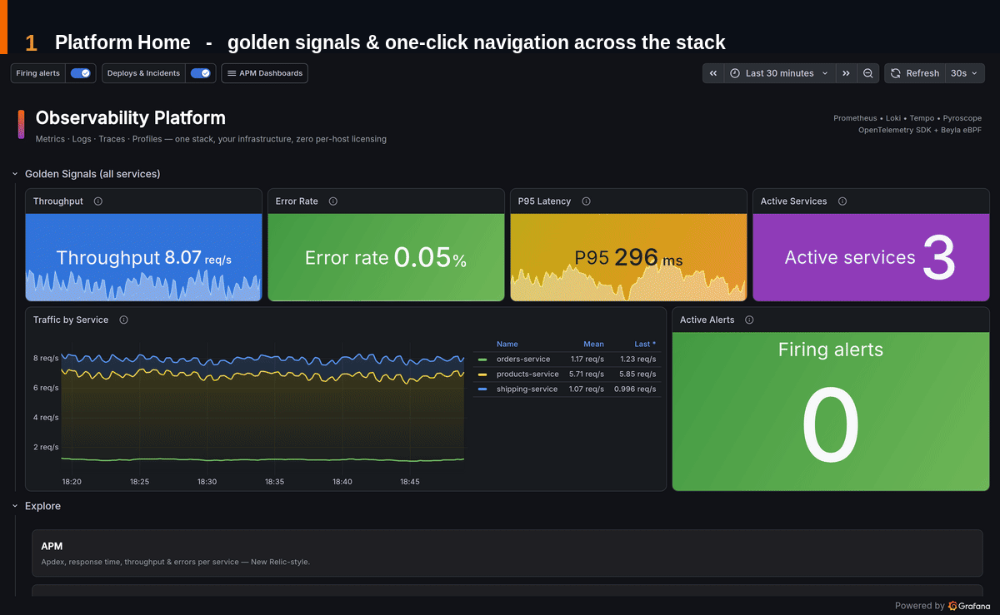
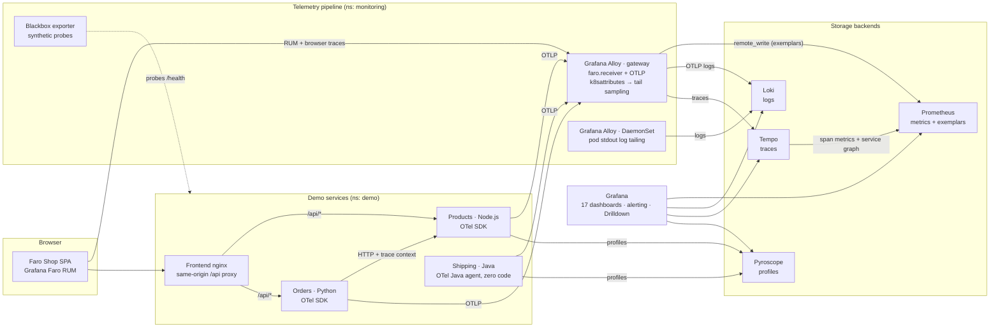
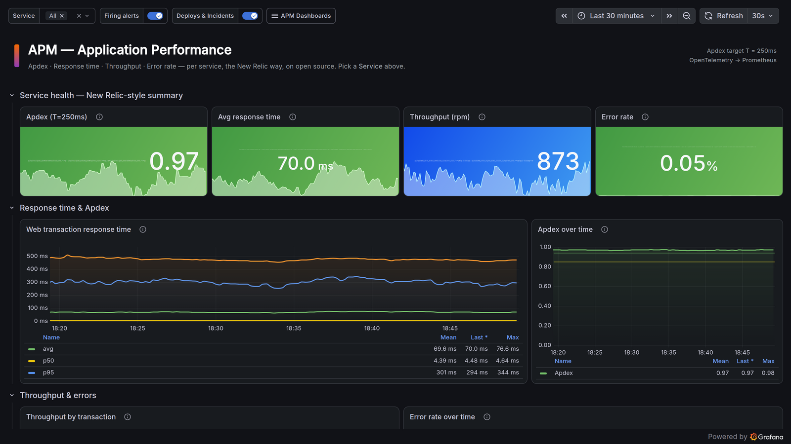
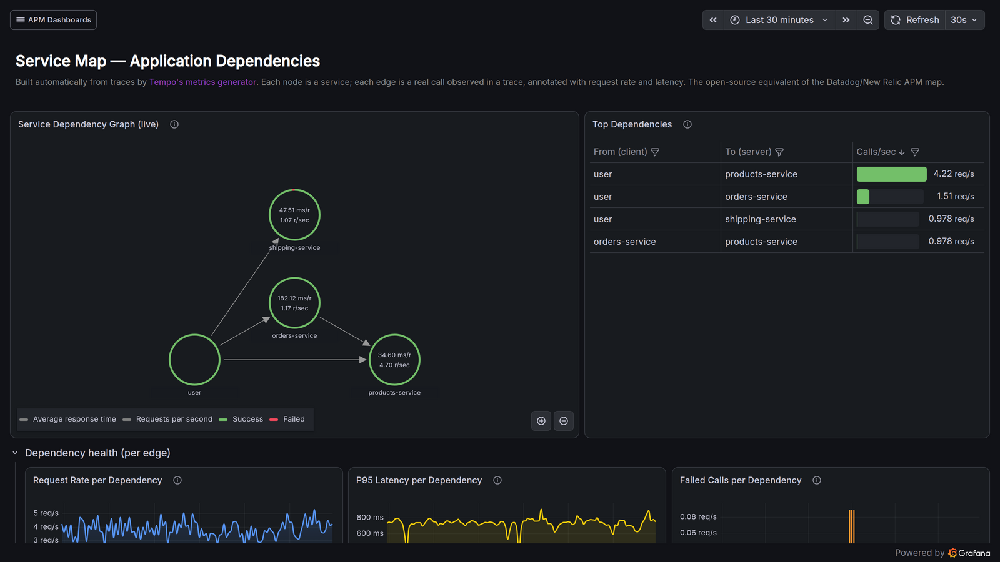
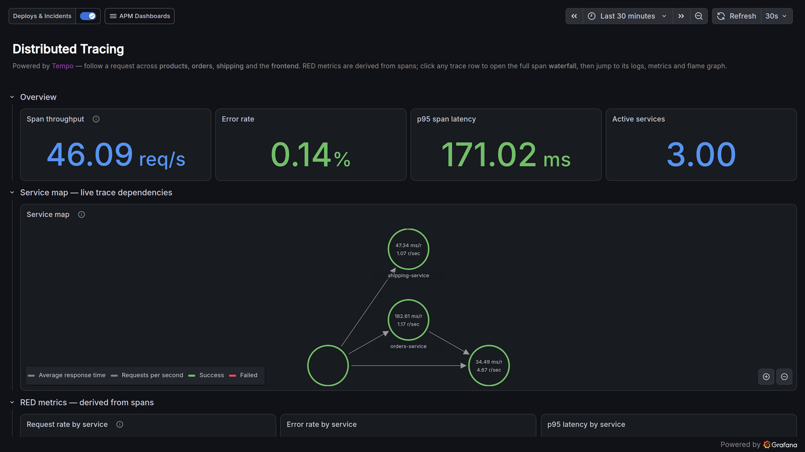
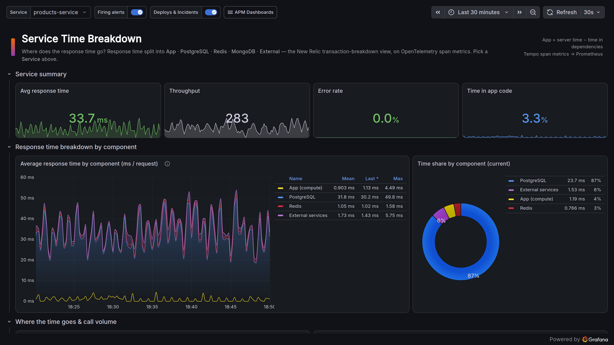
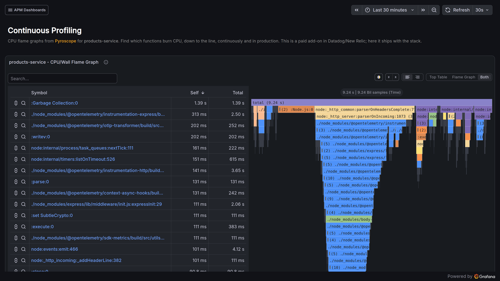
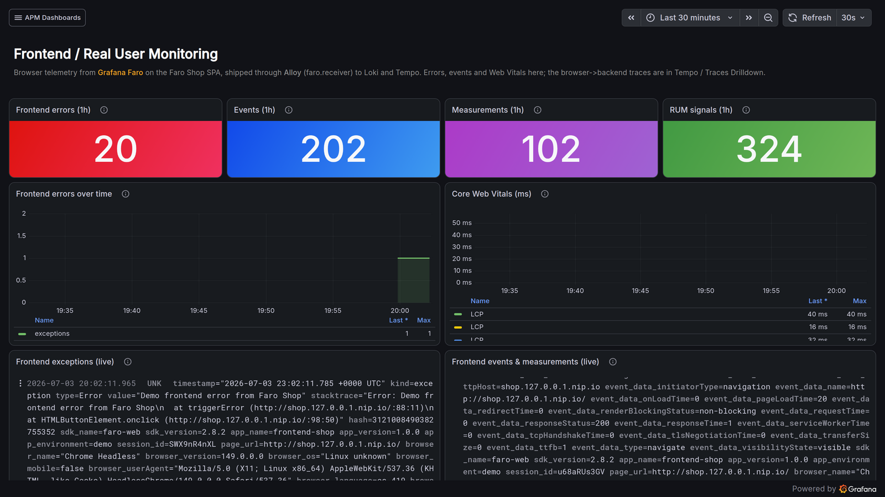
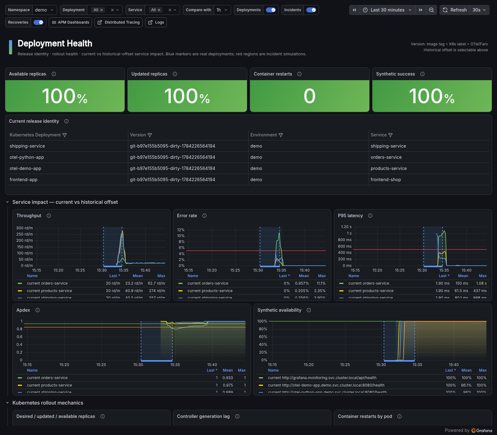

# On-Premise Observability Stack

[](https://github.com/jsalvarredy/grafana-otel-demo/actions/workflows/ci.yaml)
[](LICENSE)
[](kind/.kind/config.yaml)
[](https://opentelemetry.io/)
[](https://grafana.com/oss/)
[](CONTRIBUTING.md)

Complete observability with Grafana, Prometheus, Loki, and Tempo. Open source. No per-host licensing. Your data stays in your infrastructure.

<p align="center">
  
  <br>
  <em>A 25-second tour of the included dashboards, live on the demo stack — metrics, traces, logs, profiles, RUM and SLOs. No SaaS, no per-host licensing.</em>
</p>

## Why This Exists

Datadog and NewRelic solve observability well. They also cost $35,000-75,000/year for 50 hosts with APM ([the math](docs/COST_ANALYSIS.md)), send all your telemetry to their cloud, and lock you into their ecosystem.

If any of these apply to you, keep reading:

- **Cost**: You're spending too much on observability SaaS
- **Data sovereignty**: Telemetry data cannot leave your network
- **Compliance**: GDPR, HIPAA, or SOC2 requirements restrict third-party data access
- **Retention**: You need more than 8-15 days of data without paying extra
- **Vendor lock-in**: You want to own your observability stack

If you are evaluating this as a Datadog or New Relic alternative, start with [FOR_CTOS.md](FOR_CTOS.md): what it replaces, the cost math, and the honest tradeoffs.

## What You Get

| Capability | This Stack | Datadog | NewRelic |
|------------|------------|---------|----------|
| Infrastructure metrics | Prometheus | $15-23/host/mo | $0.25/GB |
| Log aggregation | Loki | $0.10/GB + indexing | $0.30/GB |
| Distributed tracing | Tempo | $31/host/mo | Included (limits apply) |
| Dashboards | Grafana | Included | Included |
| Data retention | You decide — bounded by your storage | 15 days default | 8 days default |
| Data location | Your infrastructure | Datadog cloud | NewRelic cloud |
| Licensing cost | $0 | $$$ | $$$ |

## Quick Start

```bash
git clone https://github.com/jsalvarredy/grafana-otel-demo
cd grafana-otel-demo
./setup.sh
```

No `/etc/hosts` changes needed - all domains use [nip.io](https://nip.io) for automatic DNS resolution.

Access Grafana: http://grafana.127.0.0.1.nip.io
- User: `admin`
- Password: `Mikroways123`

The demo includes three instrumented microservices (Node.js, Python, and Java) that generate realistic e-commerce telemetry. The Java service is auto-instrumented with **zero code changes** — by the OpenTelemetry Java agent by default (works on any kernel), with Beyla eBPF available as a one-flag opt-in on BTF-enabled kernels. Continuous profiling is equally zero-code on Java: the Pyroscope agent rides along as a second `-javaagent` and pushes CPU/allocation/lock flame graphs.

## Cost Comparison

### Annual Cost for 50 Hosts + 100GB Logs/Month

| Vendor | Infrastructure | Logs | APM | Total |
|--------|---------------|------|-----|-------|
| Datadog Enterprise | $13,800 | $3,240 | $18,600 | ~$35,640/yr |
| NewRelic Pro | $6,000 | $360 | Included | ~$20,000/yr |
| This Stack | $0 licensing | $0 licensing | $0 licensing | Infrastructure only |

Self-hosted infrastructure cost (AWS example): ~$350/month for a production setup supporting 50 hosts.

**3-year savings: $50,000-150,000** depending on your current vendor.

See [docs/COST_ANALYSIS.md](docs/COST_ANALYSIS.md) for detailed breakdown.

## Architecture


```mermaid
flowchart LR
    subgraph browser["Browser"]
        FARO["Faro Shop SPA<br/>Grafana Faro RUM"]
    end

    subgraph demo["Demo services (ns: demo)"]
        FE["Frontend nginx<br/>same-origin /api proxy"]
        P["Products · Node.js<br/>OTel SDK"]
        O["Orders · Python<br/>OTel SDK"]
        S["Shipping · Java<br/>OTel Java agent, zero code"]
    end

    subgraph pipeline["Telemetry pipeline (ns: monitoring)"]
        A["Grafana Alloy · gateway<br/>faro.receiver + OTLP<br/>k8sattributes → tail sampling"]
        AL["Grafana Alloy · DaemonSet<br/>pod stdout log tailing"]
        BB["Blackbox exporter<br/>synthetic probes"]
    end

    subgraph storage["Storage backends"]
        PR["Prometheus<br/>metrics + exemplars"]
        L["Loki<br/>logs"]
        T["Tempo<br/>traces"]
        PY["Pyroscope<br/>profiles"]
    end

    G["Grafana<br/>17 dashboards · alerting · Drilldown"]

    FARO -- "RUM + browser traces" --> A
    FARO --> FE
    FE -- "/api/*" --> P
    FE -- "/api/*" --> O
    O -- "HTTP + trace context" --> P
    P -- OTLP --> A
    O -- OTLP --> A
    S -- OTLP --> A
    P -- profiles --> PY
    S -- profiles --> PY
    A -- "remote_write (exemplars)" --> PR
    A -- "OTLP logs" --> L
    A -- traces --> T
    AL -- logs --> L
    T -- "span metrics + service graph" --> PR
    BB -. "probes /health" .-> demo
    G --> PR
    G --> L
    G --> T
    G --> PY
```

The same load can also be driven by an in-cluster **k6** Job
(`./k6.sh`), which remote-writes its own metrics to Prometheus while
exercising the instrumented services.

## This is a Demo

This repository is designed for **evaluation**, not production deployment.

| Aspect | Demo | Production Required |
|--------|------|---------------------|
| Kubernetes | Kind (local) | Managed K8s or self-managed cluster |
| Storage | Ephemeral | Persistent volumes with backups |
| High availability | Single replicas | Multi-replica across zones |
| TLS | None | TLS everywhere |
| Authentication | Basic auth | SSO/OIDC integration |

For production deployment guidance, see [docs/PRODUCTION.md](docs/PRODUCTION.md).

## What's Included

### Observability Stack
- **Grafana** - Dashboards and visualization
- **Prometheus** - Metrics collection and alerting
- **Loki** - Log aggregation
- **Tempo** - Distributed tracing
- **Pyroscope** - Continuous profiling (flame graphs)
- **Grafana Alloy** - Unified telemetry pipeline: OTLP gateway with tail
  sampling, Faro (RUM) receiver, and node-level log collection
- **Blackbox exporter** - Synthetic / uptime probes

### Demo Applications
- **Products Service** (Node.js) - Catalog, search, inventory
- **Orders Service** (Python) - Order processing, user sessions
- **Shipping Service** (Java) - Shipment quotes, tracking, order fulfillment
- **Faro Shop** (frontend) - Instrumented browser SPA: Real User Monitoring + full-stack browser→backend tracing

### Instrumentation Approaches

This demo showcases two instrumentation strategies side by side:

| Approach | Services | How it works |
|----------|----------|--------------|
| OTEL SDK (manual) | Products, Orders | Libraries added to the application code |
| Auto-instrumentation (zero code) | Shipping | **OpenTelemetry Java agent** by default (bytecode, works on any kernel); **Beyla eBPF** available as an opt-in on BTF-enabled kernels |

Both strategies for Shipping require **zero application code changes**. The Java
agent is the default because it works on any kernel; Beyla (eBPF) is a one-flag
opt-in to showcase kernel-level auto-instrumentation where BTF is available.

See [docs/BEYLA.md](docs/BEYLA.md) for a deep dive on Beyla and when to use each approach.

### Pre-built Dashboards (17 included)
- Platform Home (landing page: golden signals + deep links to every view)
- Deployment Health (real release annotations, unique release identity, rollout status and historical-offset comparison)
- APM (New Relic-style single pane: Apdex, response time, throughput, error rate + per-transaction table)
- Service Time Breakdown (New Relic-style transaction breakdown: response time split per service into App / PostgreSQL / Redis / MongoDB / External)
- Service Overview (RED metrics)
- Service Map (APM dependency graph)
- Distributed Tracing
- Continuous Profiling (CPU/wall flame graphs)
- Log Analysis
- Logs Search
- Executive Summary
- Observability Overview
- SLO/SLI Error Budget
- Synthetic Monitoring (external uptime probes)
- Frontend / RUM (browser errors, Web Vitals, full-stack traces)
- k6 Load Testing (load-test VUs, throughput, latency and errors, via Prometheus remote write)
- Kubernetes Cluster Overview

### Queryless Exploration (Grafana Drilldown)

Point-and-click exploration of metrics, logs, traces, and profiles — **no
PromQL/LogQL/TraceQL required**. Available under **Drilldown** in the Grafana
navigation. This is the fastest way for anyone to investigate the telemetry
without learning a query language.

### Four Signals, Synthetic Monitoring & SLOs

- **Four-signal correlation** — metrics, logs, traces and profiles all link to
  each other. Jump from a latency exemplar to a trace, from a span to its logs,
  and from a span to its CPU/wall **flame graph** (trace → profile).
- **Synthetic monitoring** — external blackbox probes check each service's
  health endpoint from outside (up/down, latency, HTTP status), the open-source
  counterpart to Datadog/New Relic Synthetics. See the **Synthetic Monitoring**
  dashboard.
- **Multi-window, multi-burn-rate SLO alerts** — the error-budget burn rate is
  precomputed with Prometheus recording rules and alerted on with the Google SRE
  workbook pattern (fast + slow burn), which catches real budget burn while
  suppressing flapping.

### Frontend Observability (RUM) — full-stack

A tiny instrumented browser app (**Faro Shop**) uses **Grafana Faro** to capture
Core Web Vitals, JS errors and user sessions, shipped through **Grafana Alloy**
(`faro.receiver`) to Loki and Tempo. Because the page calls its backend on the
same origin, the OpenTelemetry web tracing **propagates the trace from the
browser into the services** — a single trace from a click in the browser through
`orders` and `products`. Real User Monitoring plus full-stack tracing, no SaaS.

### Deployment Observability

Every `setup.sh` run generates a unique release tag by default and records a **real Grafana
deployment annotation** with services, version, Git revision, environment,
actor, result and actual duration. The same version is attached to Kubernetes
Deployments/Pods, backend `service.version` and Faro `app.version`, so the blue
marker on a graph identifies the exact code that started running there.

Open **Deployment Health** to see rollout readiness, image digests, restarts,
synthetic probes and current-versus-historical-offset throughput, error rate,
P95 and Apdex (the first clean run has no older app series yet). For CI/CD or
GitOps, call the reusable script directly:

```bash
GRAFANA_TOKEN="$TOKEN" ./deploy-observe.sh \
  --service products-service --version "$VERSION" \
  --revision "$GIT_SHA" --environment production --status succeeded
```

Each successful local setup also writes an atomic, checksummed evidence bundle to
`artifacts/deployments/<deployment-id>/`: the deployment event, Kubernetes and
Helm state, image IDs, matching Grafana annotation/dashboard/alert rules, and
post-deploy throughput, error ratio, P95, Apdex, probes and restarts. These
runtime snapshots are ignored by Git and are intended for CI artifact storage.

See [docs/DEPLOYMENT_OBSERVABILITY.md](docs/DEPLOYMENT_OBSERVABILITY.md) for the
CI contract, snapshot contents, authentication and cardinality guardrails.

### Traffic Generator
```bash
./traffic.sh                     # Run 50 iterations
./traffic.sh --iterations 100    # Run 100 iterations
./traffic.sh --continuous        # Run until Ctrl+C
./traffic.sh --continuous --fast # Fast continuous traffic
```

### Load Testing (Grafana k6)
```bash
./k6.sh                          # in-cluster load test (10 VUs, 3m hold)
./k6.sh --vus 25 --hold 5m       # heavier / longer run
./k6.sh --logs                   # follow the run to completion
./k6.sh --local                  # run with a local k6 against the ingress
```
On-brand load generation with **Grafana k6**: results stream to Prometheus via
remote write and show on the **k6 Load Testing** dashboard, while the same load
also drives the RED dashboards, traces and the service map.

### Incident Injector (for live demos)
```bash
./incident.sh                    # errors + latency (meltdown), 7 min
./incident.sh -s errors          # only 5xx errors
./incident.sh -s latency         # only high latency
./incident.sh --recover          # healthy traffic to clear the alerts
```
Drives a sustained, realistic degradation so the alerts fire and the SLO error
budget burns on screen — then recovers. It drops **incident simulation** and
**recovery** annotations on every dashboard; real release markers come from
`setup.sh` / `deploy-observe.sh`, so deployment history remains trustworthy.
Pairs with the [DEMO.md](DEMO.md) script.

## What it looks like

Real screenshots from the running demo stack — every panel is live data from the
instrumented services, not mockups. Click any image to view it full size.

<table>
<tr>
<td width="50%" valign="top">
<a href="docs/images/apm.png"></a>
<b>APM</b> — Apdex, response time, throughput and error rate per service, New Relic-style.
</td>
<td width="50%" valign="top">
<a href="docs/images/service-map.png"></a>
<b>Service Map</b> — live dependency graph, built automatically from traces.
</td>
</tr>
<tr>
<td width="50%" valign="top">
<a href="docs/images/tracing.png"></a>
<b>Distributed Tracing</b> — span throughput, latency heatmap and trace search on Tempo.
</td>
<td width="50%" valign="top">
<a href="docs/images/service-breakdown.png"></a>
<b>Service Time Breakdown</b> — response time split into App / PostgreSQL / Redis / External.
</td>
</tr>
<tr>
<td width="50%" valign="top">
<a href="docs/images/profiling.png"></a>
<b>Continuous Profiling</b> — CPU / wall flame graphs from Pyroscope.
</td>
<td width="50%" valign="top">
<a href="docs/images/rum.png"></a>
<b>Frontend / RUM</b> — Core Web Vitals, JS errors and full-stack browser-to-backend traces.
</td>
</tr>
<tr>
<td colspan="2" valign="top">
<a href="docs/images/deployment-health.png"></a>
<b>Deployment Health</b> — real deployment marker and release identity correlated with rollout, restarts, probes, throughput, errors, P95 and Apdex.
</td>
</tr>
</table>

## Documentation

| Document | Description |
|----------|-------------|
| [FOR_CTOS.md](FOR_CTOS.md) | **Brief for engineering leaders**: what this replaces from Datadog and New Relic, the cost math, and the honest tradeoffs |
| [DEMO.md](DEMO.md) | **Guided 12-minute demo script** — a full incident story, click by click |
| [docs/API.md](docs/API.md) | REST API reference for all 3 services |
| [docs/BEYLA.md](docs/BEYLA.md) | Beyla eBPF auto-instrumentation guide |
| [docs/TROUBLESHOOTING.md](docs/TROUBLESHOOTING.md) | Common issues and solutions |
| [docs/PRODUCTION.md](docs/PRODUCTION.md) | Production deployment guide |
| [docs/DEPLOYMENT_OBSERVABILITY.md](docs/DEPLOYMENT_OBSERVABILITY.md) | Real deploy annotations, release identity, CI/CD contract and cardinality guardrails |
| [docs/COST_ANALYSIS.md](docs/COST_ANALYSIS.md) | Detailed cost comparison |
| [docs/IMPROVEMENTS.md](docs/IMPROVEMENTS.md) | APM and metrics improvements log (historical) |
| [docs/VERIFICATION_CHECKLIST.md](docs/VERIFICATION_CHECKLIST.md) | Metrics verification checklist |
| [CHANGELOG.md](CHANGELOG.md) | Notable changes per release |
| [CONTRIBUTING.md](CONTRIBUTING.md) | How to contribute and validate changes |
| [SECURITY.md](SECURITY.md) | Security policy and what's demo-by-design |

## Requirements

- Docker (>=20.10)
- Kind (>=0.20)
- Kubectl (>=1.28)
- Helm (>=3.12)
- Helmfile (>=0.150)

## Cleanup

```bash
kind delete cluster --name grafana-otel-demo
```

## License

MIT - see [LICENSE](LICENSE)
