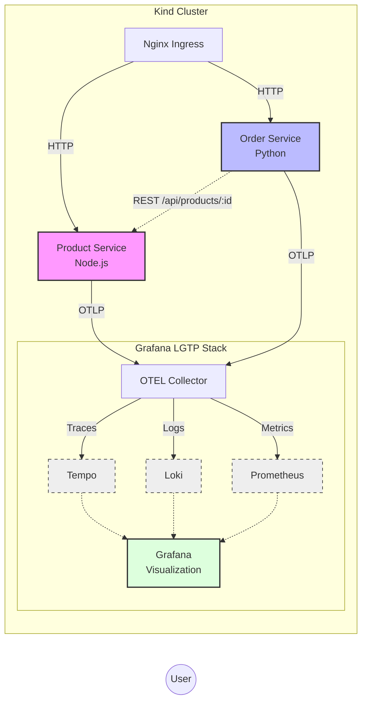

# Grafana LGTP + OpenTelemetry Demo

> **⚡ Production-Grade Observability in Minutes** - Experience the complete power of modern observability with OpenTelemetry and the Grafana stack, running locally in just one command.

[](https://opentelemetry.io/)
[](https://grafana.com/)
[](https://kind.sigs.k8s.io/)
[](LICENSE)

## 🎯 Why This Demo?

This isn't just another "hello world" observability example. This demo shows you **exactly what developers need to see** when evaluating open-source observability:

✅ **Real microservices** with actual business logic (Products & Orders)  
✅ **Distributed tracing** across service boundaries  
✅ **Automatic correlation** between logs, traces, and metrics  
✅ **Professional dashboards** ready to use  
✅ **Zero configuration** - works out of the box  
✅ **Inter-service communication** showing the true power of distributed tracing

**Perfect for:** Technical demos, proof-of-concepts, learning OpenTelemetry, evaluating Grafana stack

---

## 🚀 Quick Start

### Prerequisites

Ensure you have these tools installed:
- **Docker** (≥20.10) - [Install](https://docs.docker.com/get-docker/)
- **Kind** (≥0.20) - [Install](https://kind.sigs.k8s.io/docs/user/quick-start/#installation)
- **Kubectl** (≥1.28) - [Install](https://kubernetes.io/docs/tasks/tools/)
- **Helm** (≥3.12) - [Install](https://helm.sh/docs/intro/install/)
- **Helmfile** (≥0.150) - [Install](https://github.com/helmfile/helmfile#installation)

### One-Command Setup

```bash
git clone https://github.com/your-org/grafana-otel-demo
cd grafana-otel-demo
./setup.sh
```

**Setup time**: 5-10 minutes (mostly waiting for containers to start)

The script will:
1. ✅ Create a Kind Kubernetes cluster
2. ✅ Deploy the complete Grafana LGTP stack (Loki, Grafana, Tempo, Prometheus)
3. ✅ Deploy OpenTelemetry Collector
4. ✅ Build and deploy demo microservices
5. ✅ Provision professional dashboards
6. ✅ Generate sample telemetry data

### Configure DNS

Add to your `/etc/hosts`:

```bash
127.0.0.1 grafana-otel-demo.localhost otel-example.localhost python-otel-example.localhost
```

**Quick command:**
```bash
echo '127.0.0.1 grafana-otel-demo.localhost otel-example.localhost python-otel-example-localhost' | sudo tee -a /etc/hosts
```

### Access the Platform

🎨 **Grafana Dashboard**: http://grafana-otel-demo.localhost
```
User:     admin
Password: Mikroways123
```

🛍️ **Products Service** (Node.js): http://otel-example.localhost  
🛒 **Orders Service** (Python): http://python-otel-example.localhost

---

## 🏗️ Architecture

This demo simulates a realistic e-commerce platform with two microservices:



### Service Communication Flow

When a user creates an order, you'll see distributed tracing in action:

```
User Request → Orders Service → Products Service
                      ↓                ↓
                   [Span 1]        [Span 2]
                      ↓                ↓
              OTEL Collector ← OTEL Collector
                      ↓
                 Tempo (Traces)
                 Loki (Logs with trace_id)
                 Prometheus (Metrics)
                      ↓
                  Grafana (Visualization)
```

---

## 🧪 Exploring the Demo

### 1. View Pre-configured Dashboards

Navigate to **Dashboards → Browse** in Grafana. You'll find:

#### 📊 **Service Overview Dashboard**
- Request rate (req/s) by service
- Error rate with threshold alerts
- Response latency percentiles (p50, p95, p99)
- Top endpoints by traffic
- Detailed endpoint statistics table

#### 🔍 **Distributed Tracing Dashboard**
- Recent traces from both services
- Span duration distribution
- Spans per second
- TraceQL search interface

#### 📝 **Logs Analysis Dashboard**
- Log volume by service
- Log level distribution (INFO, WARNING, ERROR)
- Recent error logs
- Logs with trace context for correlation

### 2. Generate Traffic

Create realistic e-commerce activity:

```bash
# Browse product catalog
curl http://otel-example.localhost/api/products

# View a specific product (creates trace + logs + metrics)
curl http://otel-example.localhost/api/products/1

# Create an order (triggers inter-service call!)
curl -X POST http://python-otel-example.localhost/api/orders \
  -H 'Content-Type: application/json' \
  -d '{"product_id": 3, "quantity": 2, "user_id": "user-42"}'

# Check order status
curl http://python-otel-example.localhost/api/orders/ORD-00001

# Get all orders for a user
curl http://python-otel-example.localhost/api/orders/user/user-42
```

### 3. See Distributed Tracing in Action

**Try this workflow:**

1. Create an order using the curl command above
2. Go to Grafana → **Explore** → Select **Tempo**
3. Search for service: `orders-service`
4. Click on a recent trace
5. **Notice:** You'll see spans from BOTH services in one trace!
   - Orders Service: create-order, fetch-product-details, validate-inventory, complete-purchase
   - Products Service: get-product-by-id, check-inventory, purchase-product

This shows the power of distributed tracing across microservices!

### 4. Correlate Logs with Traces

**Try this correlation workflow:**

1. Go to Grafana → **Explore** → Select **Loki**
2. Query: `{service_name="orders-service"} | json | level="INFO"`
3. Find a log entry with a `trace_id`
4. **Click on the trace_id link** → It jumps to the trace in Tempo!
5. In the trace view, **click "Logs for this span"** → Back to Loki!

This demonstrates the seamless correlation between logs and traces.

### 5. Explore Metrics 

Go to Grafana → **Explore** → Select **Prometheus**

Try these queries:
```promql
# Request rate by service
sum(rate(http_requests_total[5m])) by (service_name)

# Error rate
sum(rate(http_requests_total{http_status_code=~"5.."}[5m])) / sum(rate(http_requests_total[5m]))

# Product views
rate(products_viewed_total[5m])

# Orders created
rate(orders_created_total[5m])
```

---

## 🎓 Key Concepts Demonstrated

### OpenTelemetry Standards
- ✅ **OTLP Protocol** for telemetry export
- ✅ **Semantic Conventions** for consistent attribute naming
- ✅ **Context Propagation** across service boundaries
- ✅ **Multi-language support** (Node.js + Python)

### Observability Patterns
- ✅ **RED Metrics** (Rate, Errors, Duration)
- ✅ **Structured Logging** with JSON
- ✅ **Trace Context in Logs** (trace_id, span_id)
- ✅ **Custom Metrics** (business KPIs like purchases, inventory)
- ✅ **Distributed Tracing** across microservices

### Grafana LGTP Stack
- ✅ **Loki** for log aggregation
- ✅ **Grafana** for visualization
- ✅ **Tempo** for distributed tracing
- ✅ **Prometheus** (replacing Mimir) for metrics storage

---

## 🐛 Troubleshooting

### Pods not starting

```bash
# Check pod status
kubectl get pods -n monitoring
kubectl get pods -n demo

# View logs
kubectl logs -n monitoring <pod-name>
kubectl logs -n demo <pod-name>
```

### Can't access Grafana

1. Check ingress is running:
   ```bash
   kubectl get pods -n ingress-nginx
   ```

2. Verify /etc/hosts entry exists

3. Try accessing via port-forward:
   ```bash
   kubectl port-forward -n monitoring svc/grafana 3000:80
   # Then access http://localhost:3000
   ```

### No data in dashboards

1. Check OTEL Collector is running:
   ```bash
   kubectl get pods -n monitoring | grep otel-collector
   ```

2. Generate more traffic (run the curl commands above)

3. Check collector logs:
   ```bash
   kubectl logs -n monitoring -l app.kubernetes.io/name=opentelemetry-collector
   ```

### Services not communicating

Check service DNS resolution inside Orders Service:
```bash
kubectl exec -n demo deployment/otel-python-app -- curl http://otel-demo-app:8080/health
```

---

## 🧹 Cleanup

Remove everything:

```bash
kind delete cluster --name grafana-otel-demo
```

Remove /etc/hosts entries:
```bash
sudo sed -i '/grafana-otel-demo.localhost/d' /etc/hosts
```

---

## 📚 Learn More

- [OpenTelemetry Documentation](https://opentelemetry.io/docs/)
- [Grafana Tempo](https://grafana.com/oss/tempo/)
- [Grafana Loki](https://grafana.com/oss/loki/)
- [Prometheus](https://prometheus.io/)

---

## 🤝 Contributing

Found an issue or have an improvement? Pull requests are welcome!

---

## 📄 License

MIT License - see [LICENSE](LICENSE) file

---

**Built for demonstration and learning purposes**  
Questions? Open an issue or reach out!

